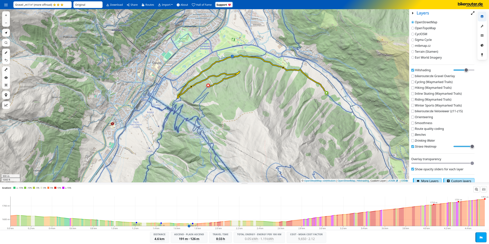

# Strava Heatmap Proxy

A utility program that serves a local proxy for the Strava heatmap, making it accessible in other programs like BRouter (e.g., `bikerouter.de` and `brouter.de`), GIS software (e.g., QGIS), and OpenStreetMap editors (e.g., iD).



## Installation

The latest version can be installed using `go install github.com/p-mng/strava-heatmap-proxy@latest`.

## Usage

- Log into your Strava account.
- Start the proxy using the command `strava-heatmap-proxy`. See the help below for an explanation of all available options.
  - By default, the program will try to extract the required cookies from Firefox (only works on macOS and Linux).
  - If this fails (because you use Windows, Chrome, or a private session), you can manually export cookies using the [Cookie-Editor extension](https://cookie-editor.com/) (download for [Firefox](https://addons.mozilla.org/en-US/firefox/addon/cookie-editor/) or [Chrome](https://chromewebstore.google.com/detail/cookie-editor/hlkenndednhfkekhgcdicdfddnkalmdm)) as JSON and pass them to the program.
  - Cookies and tiles are cached locally by default, so on subsequent launches you don't need to extract or export cookies again.
- Add the tile layer/overlay to your program of choice using the following URL: `http://localhost:8080/<sport>/{z}/{x}/{y}.png`.
  - Replace `<sport>` with the heatmap layer of your choice. List available sports using `strava-heatmap-proxy -sports`.

```
Usage of strava-heatmap-proxy:
  -cookies string
        JSON cookies exported using Cookie-Editor
  -listen string
        listen URL used for the HTTP(s) server (default "localhost:8080")
  -nocache
        disable caching of downloaded tiles and cookies
  -sports
        print some available sports types
  -useragent string
        user agent to use for HTTP requests (default "Mozilla/5.0 (Macintosh; Intel Mac OS X 10.15; rv:138.0) Gecko/20100101 Firefox/138.0")
```

## Contributing

Pull requests are welcome. For major changes, please open an issue first to discuss what you would like to change.
